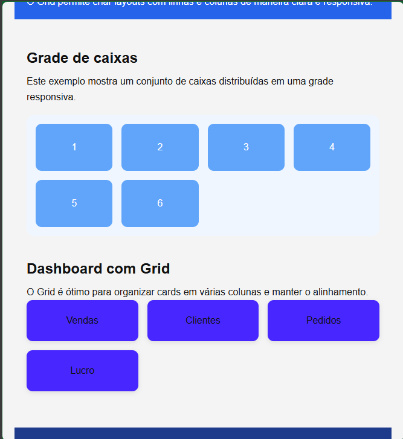

# Grid Layout x Flexbox

## Descrição

Este projeto foi desenvolvido para demonstrar as diferenças e aplicações do CSS Grid Layout e do CSS Flexbox.

O Grid Layout é utilizado para criar a estrutura principal da página, enquanto o Flexbox organiza os elementos internos.

---

## Objetivo

Demonstrar de forma prática como Grid Layout e Flexbox podem trabalhar juntos na construção de interfaces modernas e responsivas.

---

## Tecnologias Utilizadas

- HTML5
- CSS3
- CSS Grid Layout
- CSS Flexbox

---

## Instalação

1. Faça o download do projeto ou clone o repositório:

```bash
git clone URL_DO_REPOSITORIO
```

2. Abra a pasta do projeto.
3. Execute o arquivo `index.html` em qualquer navegador.

---

## Desenvolvimento

### Etapa 1
Criação da estrutura HTML contendo:

- Header
- Sidebar
- Main
- Footer

### Etapa 2
Implementação do CSS Grid para estruturar a página.

### Etapa 3
Implementação do Flexbox para organizar os cards.

### Etapa 4
Criação da responsividade utilizando Media Queries.

---

## Resultados

O projeto demonstrou:

- Organização de layout com Grid.
- Alinhamento de componentes com Flexbox.
- Responsividade para dispositivos móveis.

---

## Comparação

### Grid Layout
Vantagens:

- Estruturas complexas.
- Controle de linhas e colunas.
- Layouts completos.

Desvantagens:

- Mais complexo para iniciantes.

### Flexbox
Vantagens:

- Fácil alinhamento.
- Simples de utilizar.
- Excelente para componentes.

Desvantagens:

- Menor controle bidimensional.

---

## Capturas de Tela


### Tela Desktop


### Tela Mobile
[Mobile 1]


---

## Autor

Mateus Martims Perees, Luiz Eduardo Oliveira Mendes, Luís Henrique Rodrigues Silva, Maria Luiza Ramalho Almeida
